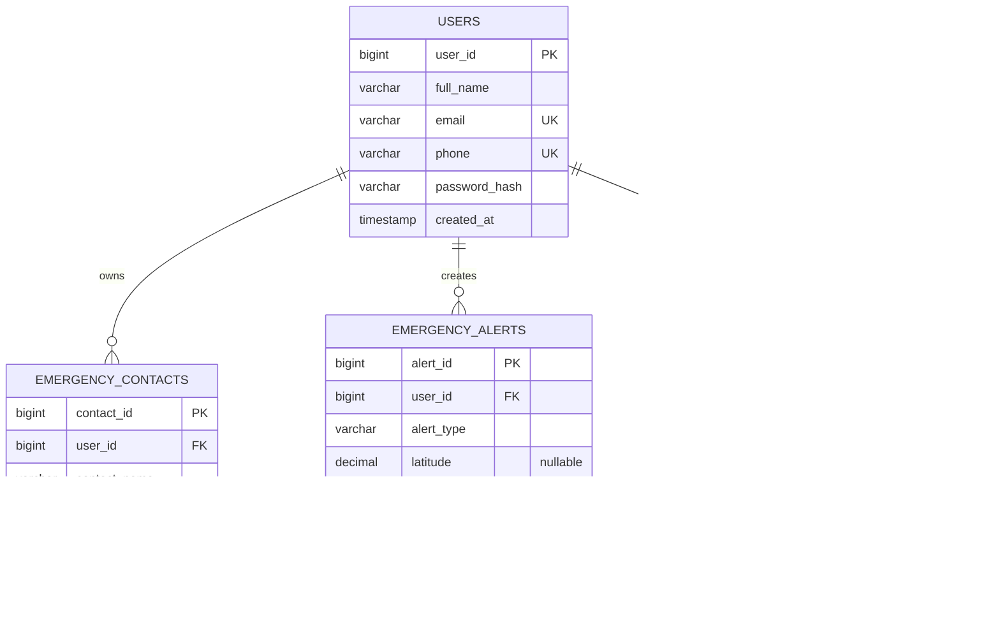

# Entity relationships

```mermaid
erDiagram
    USERS ||--o{ EMERGENCY_CONTACTS : owns
    USERS ||--o{ EMERGENCY_ALERTS : creates
    USERS ||--o{ JOURNEYS : plans
    USERS {
      bigint user_id PK
      varchar full_name
      varchar email UK
      varchar phone UK
      varchar password_hash
      timestamp created_at
    }
    EMERGENCY_CONTACTS {
      bigint contact_id PK
      bigint user_id FK
      varchar contact_name
      varchar phone
      varchar relationship_label
    }
    EMERGENCY_ALERTS {
      bigint alert_id PK
      bigint user_id FK
      varchar alert_type
      decimal latitude "nullable"
      decimal longitude "nullable"
      varchar location_note "nullable"
      timestamp created_at
      varchar status
    }
    JOURNEYS {
      bigint journey_id PK
      bigint user_id FK
      varchar start_location
      varchar destination
      timestamp start_time
      timestamp expected_arrival
      timestamp actual_arrival "nullable"
      varchar status
    }
```

Foreign keys cascade when an account is deleted. Email and phone are unique for users. Each user's records are queried by both record ID and authenticated user ID.
